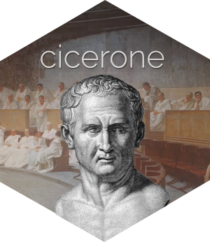
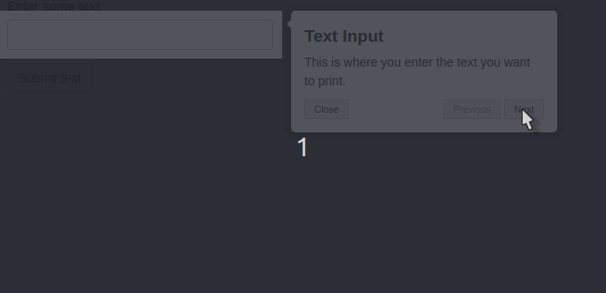

# cicerone 

[](https://travis-ci.org/JohnCoene/cicerone)

A convenient API to create guided tours of Shiny applications using [driver.js](https://kamranahmed.info/driver.js/), visit the [website](https://cicerone.john-coene.com/) for more details.

## Installation

You can install {cicerone} from Github with:

``` r
# install.packages("remotes")
remotes::install_github("JohnCoene/cicerone")
```

## Usage

Let's create a very basic Shiny app to demonstrate: it takes a text input and on hitting a button simply prints it.

```r
library(shiny)

ui <- fluidPage(
  textInput("text_inputId", "Enter some text"),
  actionButton("submit_inputId", "Submit text"),
  verbatimTextOutput("print")
)

server <- function(input, output){
  txt <- eventReactive(input$submit_inputId, {
    input$text_inputId
  })

  output$print <- renderPrint(txt())
}

shinyApp(ui, server)
```

Now we can create a guide to walk the user through the application: simply initialise a new guide from the `Cicerone` object then add `steps`.

```r
library(cicerone)

guide <- Cicerone$
  new()$ 
  step(
    el = "text_inputId",
    title = "Text Input",
    description = "This is where you enter the text you want to print."
  )$
  step(
    "submit_inputId",
    "Send the Text",
    "Send the text to the server for printing"
  )
```

This is our guide created, we can now include it the Shiny app we created earlier and start the guide. Note to that you need to include `use_cicerone` in your UI.

```r
library(shiny)

ui <- fluidPage(
  use_cicerone(), # include dependencies
  textInput("text_inputId", "Enter some text"),
  actionButton("submit_inputId", "Submit text"),
  verbatimTextOutput("print")
)

server <- function(input, output){

  # initialise then start the guide
  guide$init()$start()

  txt <- eventReactive(input$submit_inputId, {
    input$text_inputId
  })

  output$print <- renderPrint(txt())
}

shinyApp(ui, server)
```



All options are detailed in the documentation of the object: `?Cicerone`. See the [post](https://blog.john-coene.com/posts/2019-11-20-cicerone/) for more information and some rambling on the logo and package name.
