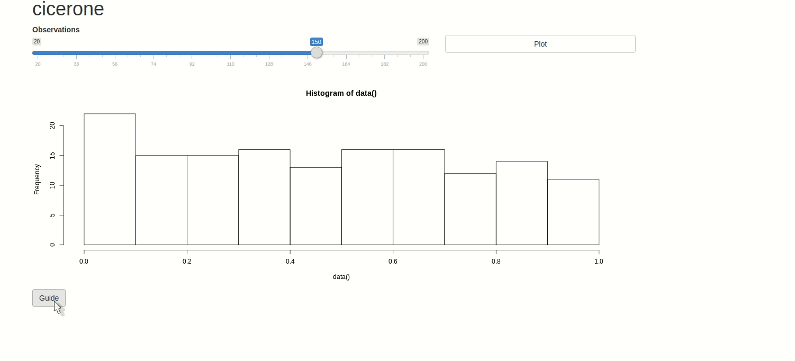

<h1 id="logo-wrapper" align="center">

<br />
Guided Tours for Shiny
<br />


</h1>

A convenient API to create guided tours of Shiny applications using [driver.js](https://kamranahmed.info/driver.js/).

## Why cicerone?

There are already R packages that let you create a guide to your Shiny application. Where cicerone differs is that it allows you to leave your actual application intact; keeping the guide separate from the app.



## Installation

You can install cicerone from Github with using either `remotes` or `devtools`.

```r
# install.packages("remotes")
remotes::install_github("JohnCoene/cicerone")
```

Once installed load the library to confirm it has been installed correctly.

```r
library(cicerone)
```

If all worked fine you are good to go.
